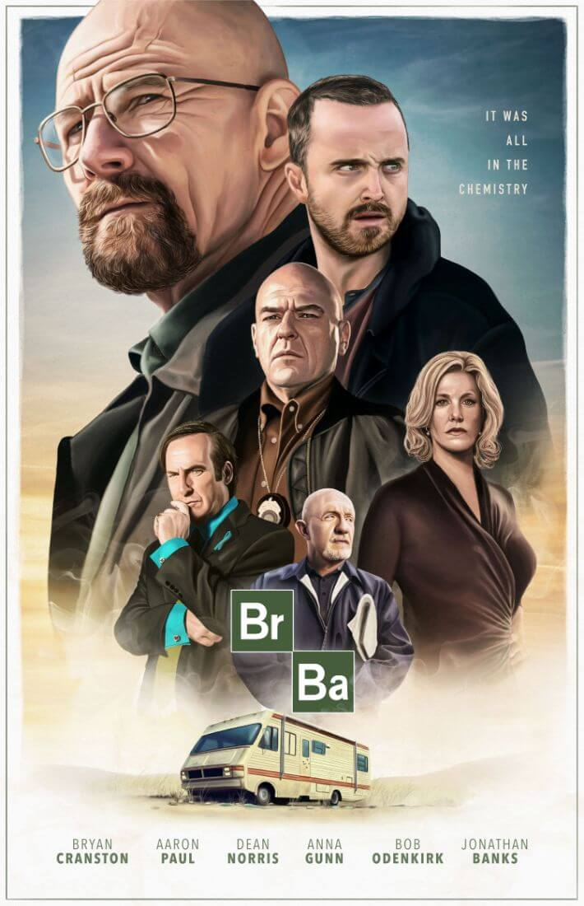

# BreakingBadOS
This is a OS in the web! It's finished now and I know it's not much cause I didn't really spend much time but its smtg I did in my free time.

The features it has:
1. It has a cool opening screen and also intro.
2. It has an app called chem Notes which mr. Walter uses to note down formulas ofcoarse.
3. It has a terminal which does everything that Mr. Walter needs.
4. There is also a calendar thats pops up when you click the date.
5. The are also buttons to re-arrange the icons after you messed with them and to open the home tab.
6. Also all tabs are resizable.

Thanks for checking out my project! See you later in my next one ;)

**Here's the link to view this website:
 https://nikhil1059.github.io/BreakingBadOS/**

---

